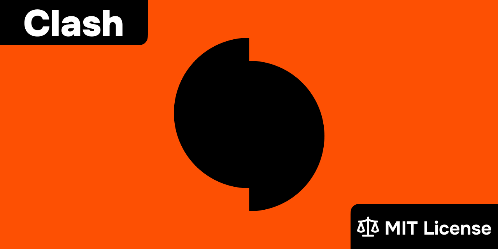
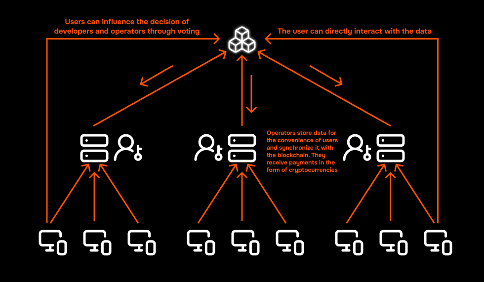

# Clash White Paper

## Abstract

Clash is an open alternative to [Hemagon](https://hemagon.com), utilizing a hybrid architecture (centralized servers + blockchain) to ensure transparency, fault tolerance, and decentralized governance.

## Problem Statement

Hemagon has encountered critical issues:

- ❌ Constant server outages
- ❌ Inability for the community to influence development
- ❌ Concentration of data and power in the hands of a single group

## Solution

Clash offers a hybrid system that combines:

- ✅ **Speed** of centralized servers for real-time interactions
- ✅ **Reliability** of the blockchain for storing critical data
- ✅ **Transparency** through open-source code and smart contracts
- ✅ **Decentralization** through the ability to launch one's own server and interacting with the blockchain

## Architecture

### Local Layer

- P2P synchronization between devices
- Excel import/export functionality
- Tournament hosting with various calculation systems (Olympic, Mixed, etc.)

### Centralized Layer

- Fast tournament processing
- Temporary storage of session data
- User data retrieval and management

### Decentralized Layer

- Immutable registry of fighter ratings
- Smart contracts for fund distribution
- Community voting on key decisions

## Technology Stack

### Desktop Application

- **Framework**: Tauri (Rust + WebView2)
- **UI Library**: React + TypeScript
- **P2P**: WebRTC for synchronization

### Server

- **Runtime**: Bun (fastest JS runtime)
- **Database**: PostgreSQL
- **API**: REST

### Blockchain

- **Network**: Polygon (speed and low fees)
- **Language**: Solidity
- **Standards**: ERC-20 for tokens

## Tokenomics

In the initial stage, a publicly available coin (e.g., MATIC) will be used. In the future, the creation of a proprietary token is possible for:

- Staking by server operators
- Voting in the DAO
- Rewarding developers

## Governance

The community will be able to influence:

1. **Technical decisions** — through proposals on GitHub or [VK](https://vk.com/clash_org)
2. **Economic parameters** — through voting in smart contracts
3. **Project development** — through a DAO (in the future)

## Languages

The Clash desktop application is fully operational and available in three languages:

- **EN** — English
- **RU** — Русский
- **ZH** — 中文

## Roadmap

#### ✅ Stage 1 [completed]

Local solution for conducting tournaments:

- Olympic and Mixed systems
- P2P synchronization
- Excel import/export

#### ⏳ Stage 2 [in development]

Client-server application:

- Complete analog of Hemagon
- Rating system
- Real-time tournaments

#### 📅 Stage 3 [planned]

Blockchain integration:

- Decentralized fighter registry
- Smart contracts for fund distribution
- DAO for governance

## Team

**Artem Podloboshnikov** — Fullstack developer with 5 years of experience.

- GitHub: [@ArtemPodloboshnikov](https://github.com/ArtemPodloboshnikov)
- Specialization: Frontend, client-server architecture

## Project Repositories

💻 [Clash Desktop](https://github.com/Clash-org/clash-desktop) – Main desktop application (Tauri + React)

🛢️ [Clash Server](https://github.com/Clash-org/clash-server) – Backend server (Bun + PostgreSQL)

🔗 [Clash Contracts](https://github.com/Clash-org/clash-contracts) – Smart contracts (Solidity + Polygon)

📱 [Clash Mobile](https://github.com/Clash-org/clash-mobile) – Mobile application (planned)

## License

MIT License — the project is completely open for use and modification.
